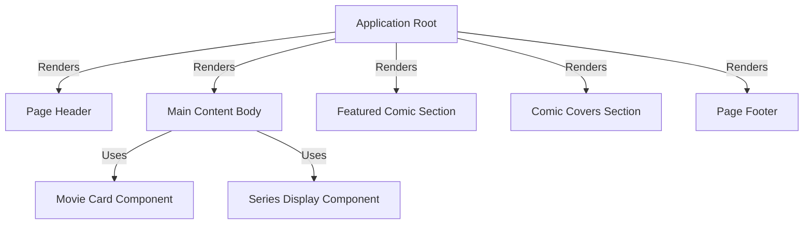

#  MarvelUI

This project is a simple website showcasing Marvel content. It acts as a central hub, displaying **information about Marvel movies and TV series**, highlighting **featured comics**, and providing a **gallery of comic covers**. It pulls together different sections like the *header*, *main content*, and *footer* to create a complete user interface for fans.

## Visual Overview

## Chapters

1. [Main Content Body
](/overview/01_main_content_body_.md)
2. [Featured Comic Section
](/overview/02_featured_comic_section_.md)
3. [Comic Covers Section
](/overview/03_comic_covers_section_.md)
4. [Page Header
](/overview/04_page_header_.md)
5. [Page Footer
](/overview/05_page_footer_.md)
6. [Application Root
](/overview/06_application_root_.md)
7. [Movie Card Component
](/overview/07_movie_card_component_.md)
8. [Series Display Component
](/overview/08_series_display_component_.md)
