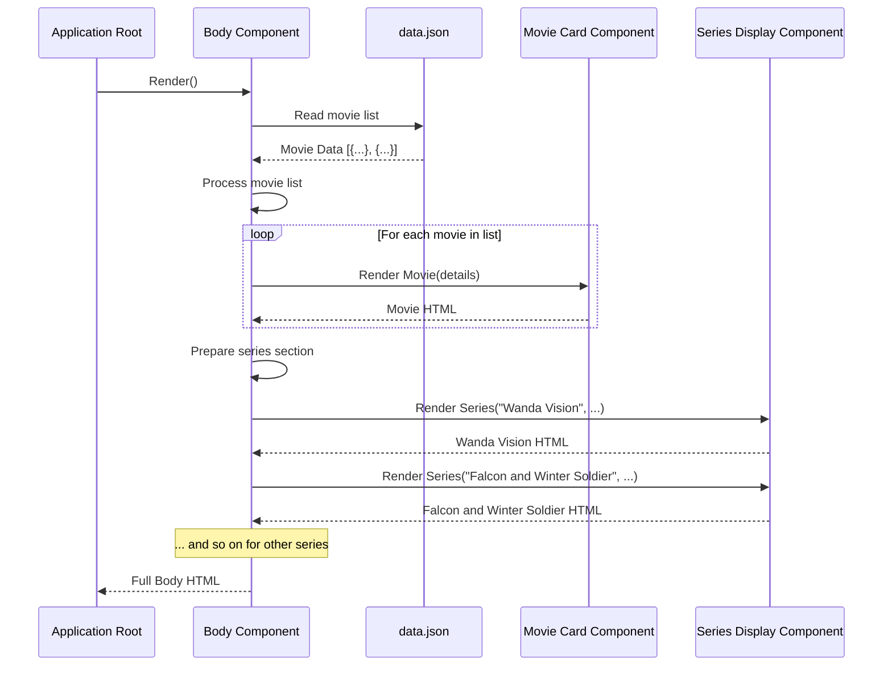

# Chapter 1: Main Content Body

Welcome to the `marvelUI` tutorial! In this first chapter, we're going to explore the very heart of our webpage – the **Main Content Body**.

Think of a museum. It has entrances, maybe signs, and different halls. But the main stuff you came to see – the exhibits – are usually in the big, central rooms. On a webpage, the **Main Content Body** is just like that main exhibition hall. It's the primary area where the important information you want the user to see is displayed.

For our `marvelUI` project, the main content we want to show is a list of Marvel movies and a list of Marvel TV series available for streaming. The **Main Content Body** is responsible for organizing and presenting these lists to the user.

## What Problem Does It Solve?

Imagine trying to put *everything* on one giant page without any structure: headers, footers, navigation, *and* all the movie and series details all mixed up. It would be a mess!

The **Main Content Body** gives us a dedicated, central place to focus on displaying the core information. It separates this main content from things like the website's title at the top ([Page Header](/overview/04_page_header_.md)) or copyright info at the bottom ([Page Footer](/overview/05_page_footer_.md)). This makes our webpage organized and easier to understand, both for us building it and for the people using it.

Our main goal in this chapter is to understand how the `Body` component acts as this central area to display our lists of movies and series.

## The `Body` Component: Our Main Hall

In our project, the **Main Content Body** is represented by a component named `Body`. A "component" in web development is just a reusable piece of code that handles a specific part of the user interface. The `Body` component is a big container that holds and arranges the different sections of our main content.

It's like the blueprint for our main museum hall. It specifies where the movie exhibit goes and where the series exhibit goes.

## How the `Body` Component Works

Let's look at the code for our `Body` component (`src/marvel/Body/Body.jsx`) to see how it does its job.

First, it needs to bring in the tools and information it requires:

```javascript
import React from "react"; // Standard tool for building interfaces
import Card from "./Movies"; // A tool to show individual movies (like a small exhibit display)
import Series from "./series"; // A tool to show individual series (another small exhibit display)

import data from '../data/data.json' // The list of movies we want to show
```
*   `React` is the basic building block for our project.
*   `Card` is a smaller component that's specifically designed to display *one* movie's information (like its picture, title, and date). We'll learn more about the [Movie Card Component](/overview/07_movie_card_component_.md) later.
*   `Series` is another smaller component designed to display *one* TV series' information (like its name, picture, and description). We'll learn more about the [Series Display Component](/overview/08_series_display_component_.md) later.
*   `data.json` is a file that holds the information (the list) about all the movies we want to display.

Next, the `Body` component defines what it will show on the screen:

```javascript
const Body = () => {  
  return (
    <div className="bg-dark">
      {/* Content goes here */}
    </div>
  );
};
```
This is the basic structure of our `Body` component. It's a function that returns some HTML (using something called JSX, which looks like HTML). The main thing it returns is a `div`, which is a common box-like element in web design, here given a dark background. This `div` is the main container for all the content inside the body.

### Displaying the Movie List

Inside that main `div`, the `Body` component first sets up a section for movies:

```javascript
      <div className="container-fluid bg-danger text-light p-4 text-center ">
        <h1>Watch All Marvel Movies on Disney+ Hotstar</h1>
      </div>
      <div
        className="container-fluid   p-3 mb-5"
        style={{ background: "#fff" }}>
        <div className="row">
          {/* Movies will be listed here */}
        </div>
      </div>
```
*   The first `div` with the red background (`bg-danger`) and white text (`text-light`) is simply a title section saying "Watch All Marvel Movies...".
*   The second `div` is a white container that will hold all the movie cards.

Now, how does it show *each* movie? Remember `data.json` has a *list* of movies. The `Body` component goes through this list:

```javascript
            {
            data.map((item) =>{
              return (
                <>
                <div className="col">
                <Card
                  key={item.id} // Unique identifier for each movie
                  img={item.img} // Pass the image URL to the Card component
                  title={item.title} // Pass the movie title
                  date={item.date} // Pass the release date
                  id={item.id} // Pass the ID again
                  ytlink={item.ytlink} // Pass the YouTube link
                />
                </div>
                </>
              );
            })
      }
```
*   `data.map((item) => { ... })` is a common way in JavaScript to go through *each item* in the `data` list. For every `item` (which represents one movie), it runs the code inside the curly braces `{}`.
*   Inside the loop, `<Card ... />` is used. This creates one [Movie Card Component](/overview/07_movie_card_component_.md) for the current `item`.
*   The information about the movie (`item.img`, `item.title`, etc.) is passed to the `Card` component using properties like `img={item.img}`. This tells the `Card` component *which* movie's details it should display.
*   The `key` property is important for React when showing lists, helping it keep track of each item.

So, this code block essentially says: "For every movie in my list (`data`), show a [Movie Card Component](/overview/07_movie_card_component_.md) using that movie's details."

### Displaying the Series List

After the movie section, the `Body` component adds a title for the series and then lists the series:

```javascript
      <div className="container-fluid bg-danger  text-light p-4 text-center">
        <h1>Watch All Series of Marvel on Disney+ Hotstar</h1>
      </div>

      <Series
        name="Wanda Vision"
        img="https://mlpnk72yciwc.i.optimole.com/cqhiHLc.WqA8~2eefa/w:auto/h:auto/q:75/https://bleedingcool.com/wp-content/uploads/2021/02/EtJXFJyVEAER0n3.jpeg"
        text="WandaVision premiered..." // (Long description here)
      />

      <Series
        name="Falcon and the Winter Soldier"
        img="..." // (Image URL here)
        text="The Falcon and the Winter Soldier premiered..." // (Long description here)
      />

      {/* ... other Series components ... */}

    </div> {/* Closes the main bg-dark div */}
  ); // Closes the return statement
}; // Closes the Body component function
```
*   Another title section for series is added.
*   Unlike the movies (which come from a data list), the series are added one by one directly in the code using the `<Series ... />` component.
*   For each series, the `<Series>` component is used, and the `name`, `img`, and `text` information is passed directly as properties.
*   This uses the [Series Display Component](/overview/08_series_display_component_.md) to show each individual series' details.

## How it Fits Together (High Level)

When the `marvelUI` application starts (we'll see how in [Application Root](/overview/06_application_root_.md)), one of the things it does is render the `Body` component.

Here's a simplified view of the process:



In simple terms:
1.  The main application asks the `Body` component to show itself.
2.  The `Body` component gets the movie data.
3.  It then goes through the movie data, asking a `Card` component to show each movie.
4.  It also asks the `Series` component to show each of the specified series.
5.  Finally, the `Body` component puts all these pieces (titles, movie cards, series displays) together and gives the complete HTML structure back to the application to be shown on the screen.

## Conclusion

In this chapter, we learned that the **Main Content Body**, represented by the `Body` component, is the central area of our webpage where we display the most important information – the lists of Marvel movies and series. We saw how it acts as a container and uses smaller components like [Movie Card Component](/overview/07_movie_card_component_.md) and [Series Display Component](/overview/08_series_display_component_.md) to show individual items.

It's like the main exhibition hall, bringing together different exhibits (sections) and using display cases (smaller components) to show the individual pieces (movies and series).

Now that we understand the main area, let's look at one of the specific sections within it. In the next chapter, we'll explore the [Featured Comic Section](/overview/02_featured_comic_section_.md).