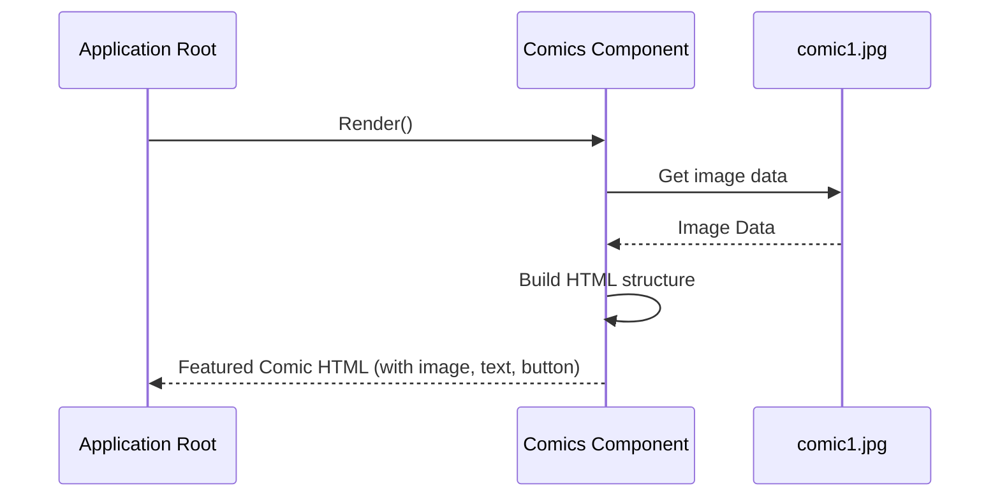

# Chapter 2: Featured Comic Section

Welcome back to the `marvelUI` tutorial! In the [previous chapter](/overview/01_main_content_body_.md), we explored the **Main Content Body**, our webpage's central area for displaying lists of movies and series – like the main exhibition hall in our museum analogy.

Now, let's look at another important part of our page, a special section dedicated to highlighting just *one* specific item: the **Featured Comic Section**. Think of this as a special display case with a spotlight on a single, important new exhibit, designed to catch your eye immediately.

## What Problem Does It Solve?

Imagine you have a huge list of comics, movies, and shows. While lists are great for browsing everything, sometimes you want to tell your visitors, "Hey! Look at *this* one! This is new and exciting!"

The **Featured Comic Section** solves this by providing a dedicated, prominent space to showcase a single comic. It cuts through the noise and focuses attention on one item, encouraging users to learn more or buy it. It's perfect for highlighting a brand new release or a special issue.

For our `marvelUI` project, this section is used to display a large image and title for a specific new comic release, making it stand out from the rest of the content.

## The `Comics` Component: Our Special Spotlight

In our project, the **Featured Comic Section** is handled by a component named `Comics`. Just like the `Body` component is a container for the main content, the `Comics` component is a self-contained piece of code responsible for displaying *this specific spotlight area*.

It knows how to show a title, some descriptive text, a button, and crucially, a large image of the featured comic.

## How to Use the `Comics` Component

Using the `Comics` component is very simple. Once it's created (which we'll look at next), you just need to include it where you want it to appear on your page.

Let's look at how it's included in our main application file, `src/App.jsx`:

```javascript
import React from "react";

// Import other components...
import Body from "./marvel/Body/Body.jsx";
// Import the Comics component
import Comics from "./marvel/footer/Comics.jsx"; // Note: The file is in 'footer' folder but is its own section
// Import other components...

const App = ()=>{
  return(
    <>
      {/* Other components like Header come first */}
      <Body/>      {/* Our main content area */}
      <Comics/>    {/* HERE it is! The Featured Comic Section */}
      {/* Other components like Footer might come after */}
    </>
  );
}

export default App;
```
See the line `<Comics/>`? That's it! By placing `<Comics/>` in the list of components that `App` renders, we are telling the application, "Include the content defined by the `Comics` component right here." It's that easy to add this special section to our page structure.

When the page loads, the `App` component will render the `Header`, then the `Body` (with all the movies and series), then the `Comics` component (our featured comic spotlight), and finally the `Footer`.

## Inside the `Comics` Component: Building the Spotlight

Let's peek inside the `Comics.jsx` file to see how this component is built and how it creates the featured comic display.

First, the component needs to import necessary tools, like React and the image it will display:

```javascript
import React from "react"; // Standard tool for building interfaces
import "../footer/Footer.css"; // Stylesheet for some look-and-feel
import comic1 from "../img/comic1.jpg"; // The specific image for the featured comic
```
*   `React` is the basic building block.
*   `Footer.css` likely contains styling rules to make the section look nice (colors, spacing, etc.).
*   `comic1` is how we bring the actual image file (`comic1.jpg`) into our component so we can display it. We give it a simple name (`comic1`) to use in the code.

Next, the `Comics` component is defined as a function that returns the HTML structure for the section:

```javascript
export default function Comics() {
  return (
    <>
      {/* Content of the featured section goes here */}
    </>
  );
}
```
This is the standard way to define a functional component in React. The `return` statement contains the JSX (HTML-like code) that will be displayed on the page.

Inside the `return`, the component sets up the structure. It typically uses containers and columns to arrange the text and image side-by-side on larger screens:

```javascript
      <div className="text-center  text-dark">
        <h1>Purchase Our Comics</h1> {/* A title for the whole section */}
      </div>
      <div className="container-fluid"> {/* Main container for the featured comic */}
        <div className="row mb-5">    {/* A row to put content side-by-side */}
          <div className="col-lg-6 col-md-6 col-12"> {/* Column for text/button on the left */}
            {/* Text content goes here */}
          </div>
          <div className="col-lg-6 col-md-6 col-12"> {/* Column for the image on the right */}
            {/* Image goes here */}
          </div>
        </div>
      </div>
```
*   The first `div` adds a general heading "Purchase Our Comics" for the whole section.
*   The `container-fluid` and `row` are common web design patterns (often from Bootstrap, which this project seems to use) for creating responsive layouts. A `row` is like a horizontal line, and `col-...` classes divide that line into columns.
*   Here, it's split into two columns that take up half the width (`col-lg-6 col-md-6`) on larger screens, but stack vertically (`col-12`) on small screens (like phones).

Now, let's fill those columns with the actual content. The left column gets the text and button:

```javascript
          <div className="col-lg-6 col-md-6 col-12">
            <h5 className="left-comic1">ON SALE 8/4</h5>
            <h1 className="left-comic2 text-danger">NEW COMICS THIS WEEK</h1>
            <p className="left-comic3">
              <b>Check out the newest Marvel comics coming out this week!</b>
            </p>
            <div className="butt">
              <button type="button" className="btn btn-info">
                SHOP DIGITAL COMIC
              </button>
            </div>
          </div>
```
This is straightforward HTML: headings (`h5`, `h1`), a paragraph (`p`) with bold text (`<b>`), and a button. The classes like `left-comic1`, `text-danger`, `btn btn-info` apply styling to make them look a certain way.

And the right column gets the featured comic image:

```javascript
          <div className="col-lg-6 col-md-6 col-12">
            
          </div>
```
This is the `` tag, which is used to display images on a webpage.
*   `src={comic1}` tells the image tag *where* to find the image. We use the `comic1` name we imported earlier.
*   `className="img-fluid"` is a styling class that helps the image resize nicely to fit its container (the column).
*   `alt="img"` provides alternative text for the image, which is important for accessibility and if the image can't be loaded.

Putting it all together, the `Comics` component defines this specific layout with the imported image and hardcoded text/button, and returns it as a block of HTML ready to be placed on the page wherever `<Comics/>` is used in the `App` component.

## How it Fits Together (High Level)

When the main application (`App`) is built, it includes the `Comics` component. Here's a simple view of what happens related to this component:



In simple terms:
1.  The main application asks the `Comics` component to show itself.
2.  The `Comics` component gets the data for the image it needs to display.
3.  It then constructs the specific HTML layout (titles, text, button on the left, image on the right).
4.  Finally, the `Comics` component gives this complete block of HTML back to the application to be shown on the screen as the **Featured Comic Section**.

## Conclusion

In this chapter, we learned about the **Featured Comic Section**, a dedicated area to put a spotlight on a single, important comic. We saw that it's implemented as a self-contained `Comics` component in our `marvelUI` project. We also saw how easy it is to include this component in the main application (`App.jsx`) and got a look inside `Comics.jsx` to understand how it arranges text, a button, and an image using columns to create the visual layout.

It's like setting up a special, eye-catching display case for the star item in our museum.

Now that we've covered the featured comic spotlight, let's look at another section dedicated to showing *multiple* comics in a different way. In the next chapter, we'll explore the [Comic Covers Section](/overview/03_comic_covers_section_.md).
