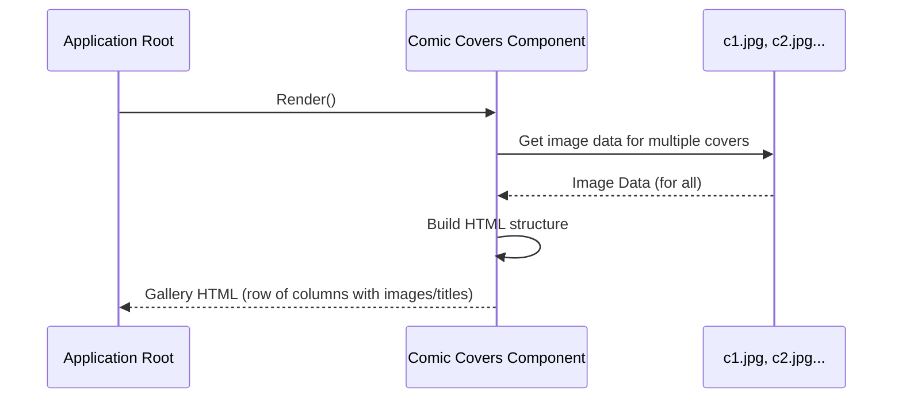

# Chapter 3: Comic Covers Section

Welcome back, future web developer! In our [previous chapter](/overview/02_featured_comic_section_.md), we learned about the **Featured Comic Section**, which is like a special spotlight focusing on just *one* important item.

Now, let's move on to a different way of displaying comics: the **Comic Covers Section**. If the featured section is a spotlight on one piece, this section is like a **gallery wall** or a **display rack** in a comic book store. It's designed to show *multiple* comic book covers side-by-side so you can quickly see a variety of options at a glance.

## What Problem Does It Solve?

Imagine going into a comic book store and only seeing one comic displayed prominently. That would be okay if you knew exactly what you wanted, but usually, you want to browse! You want to see rows and rows of different covers to find something that catches your eye.

The **Comic Covers Section** solves the problem of displaying multiple items efficiently. It gives users a visual catalog, letting them quickly scroll through several comic covers without having to look at detailed information for each one individually. This is great for browsing and discovering new titles.

For our `marvelUI` project, this section shows a collection of recent comic covers in a horizontal layout, making it easy for users to get a sense of the available comics.

## The `Card` Component: Our Gallery Rack

In our project, the **Comic Covers Section** is handled by a component named `Card`. Now, this name might be a little confusing because we also saw a `Card` component used for movies in the [Main Content Body](/overview/01_main_content_body_.md). But in this specific part of the code (`src/marvel/footer/Card.jsx`), the `Card` component is built *specifically* to display the *multiple comic covers* that make up our gallery wall.

It's like having different types of "display cases" (components) that might both be called "card" in general terms, but are designed for different things (movies vs. multiple comic covers).

## How to Use the `Card` Component (for Comic Covers)

Just like with the `Comics` component for the featured section, using the `Card` component for the comic covers is simple. You just need to include it where you want the gallery wall to appear on your page.

Let's look at how it's included in our main application file, `src/App.jsx`:

```javascript
// ... other imports
import Body from "./marvel/Body/Body.jsx";
import Comics from "./marvel/footer/Comics.jsx";
// Import the Card component from the footer folder
import Card from "./marvel/footer/Card.jsx"; // This is our Comic Covers component
import Footer from "./marvel/footer/Footer.jsx";

const App = ()=>{
  return(
    <>
      {/* ... other components */}
      <Body/>      {/* Main content (movies/series) */}
      <Comics/>    {/* Featured Comic spotlight */}
      <Card/>      {/* HERE it is! The Comic Covers gallery */}
      <Footer/>    {/* The page footer */}
    </>
  );
}
// ... export App
```
In the `App` component's `return` statement, you can see `<Card/>`. By placing this line after the `<Comics/>` component, we are telling the application to render the **Comic Covers Section** right after the **Featured Comic Section**.

When the `marvelUI` page is built, the `App` component arranges these sections in order: first the header (which we'll cover later), then the `Body` (movies and series), then the `Comics` (featured comic), then the `Card` (comic covers gallery), and finally the `Footer`.

## Inside the `Card` Component: Building the Gallery

Now, let's open the `src/marvel/footer/Card.jsx` file to see how this component creates the row of comic covers.

First, it needs to bring in the necessary tools and, importantly, the images for each comic cover:

```javascript
import React from "react"; // The standard React tool
import Tilt from "react-parallax-tilt"; // A tool for adding a visual tilt effect
import c1 from "../img/c1.jpg"; // Image for the first comic
import c2 from "../img/c2.jpg"; // Image for the second comic
import c3 from "../img/c3.jpg"; // Image for the third comic
import c4 from "../img/c4.jpg"; // Image for the fourth comic
import c5 from "../img/c5.jpg"; // Image for the fifth comic
import c6 from "../img/c6.jpg"; // Image for the sixth comic
```
*   `React` is fundamental.
*   `Tilt` is an extra library that adds a cool visual effect where the image slightly tilts as you move your mouse over it. It's not essential for the *concept* of displaying covers, but it adds polish.
*   `c1` through `c6` are the imported images. Each variable (`c1`, `c2`, etc.) now holds the data needed to display one specific comic cover image file.

Next, the `Card` component is defined:

```javascript
export default function Card() {
  return (
    <div>
      {/* Content of the comic covers section goes here */}
    </div>
  );
}
```
This is the basic structure of the component. The `return` statement will contain the JSX (HTML-like code) for our gallery wall.

Inside the `return`, the component sets up the layout using containers and columns, similar to the featured section, but this time with *more* columns to fit several covers:

```javascript
      <section className="cardss">
        <div className="container">
          <div className="row p-2" >
            {/* Individual comic covers will go in columns here */}
          </div>
        </div>
      </section>
```
*   `<section>` and `<div className="container">` provide overall structure and centering.
*   `<div className="row p-2">` is the key part that creates a horizontal row. The `p-2` likely adds some padding (space) around the content.

Now, to place each comic cover, it uses columns *inside* that row. For each comic cover we want to display, it creates a separate column:

```javascript
            <div className="col-md-2"> {/* Column for one comic cover */}
              <Tilt> {/* The tilt effect wrapper */}
                
                <p>
                  <b>Extreme Carnage: Lasher (2021) #1</b> {/* Comic title */}
                </p>
              </Tilt>
            </div>
            {/* ... and similar columns for c2, c3, c4, c5, c6 ... */}
```
*   `<div className="col-md-2">` creates a column that takes up 2 units of width out of 12 available units (a standard grid system). On medium-sized screens (`md`) and larger, it will try to fit 6 such columns in one row (12 / 2 = 6). On smaller screens, these columns will stack vertically. This is how we get the side-by-side layout that wraps onto new lines if the screen is too small.
*   `<Tilt>` wraps the content inside the column to apply the tilt effect.
*   `` displays the actual image for the comic cover using the imported `c1` variable. The `style` property sets a fixed size for the image.
*   `<p><b>...</b></p>` displays the title of the comic below the image.

This pattern is repeated six times, once for each imported image (`c1` through `c6`), each within its own `<div className="col-md-2">`.

Unlike the movie list in the `Body` component that used a `map` function to loop through data, this `Card` component for comic covers directly lists each cover's HTML structure one by one in the code.

## How it Fits Together (High Level)

When the main application (`App`) is built, it includes the `Card` component for the comic covers gallery. Here's a simple view of what happens:



In simple terms:
1.  The main application asks the `Card` component to show itself.
2.  The `Card` component gets the data for all the specific comic cover images it needs to display (`c1.jpg` through `c6.jpg`).
3.  It then constructs the HTML layout: a row with multiple columns, placing one image and title inside each column.
4.  Finally, the `Card` component gives this complete block of HTML back to the application to be shown on the screen as the **Comic Covers Section**, displaying the gallery wall of comics.

## Conclusion

In this chapter, we learned about the **Comic Covers Section**, which provides a way to display *multiple* comic book covers together, like a gallery wall or display rack. We saw that this is handled by the `Card` component located in `src/marvel/footer/Card.jsx`. We understood how it's included in the main application (`App.jsx`) and looked inside `Card.jsx` to see how it imports multiple images and uses a row with several columns to lay out each comic cover and its title side-by-side.

This section is different from the **Featured Comic Section** because its goal is browsing many items, not highlighting just one.

Now that we've covered the main content area, the featured comic, and the comic covers gallery, let's shift our focus to the areas that frame our content. In the next chapter, we'll explore the [Page Header](/overview/04_page_header_.md).

