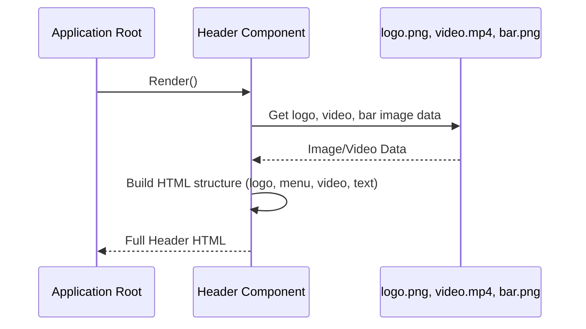

# Chapter 4: Page Header

Welcome back to the `marvelUI` tutorial! In the last few chapters, we explored the main parts of our webpage: the [Main Content Body](/overview/01_main_content_body_.md) (the central exhibit hall), the [Featured Comic Section](/overview/02_featured_comic_section_.md) (a special spotlight display), and the [Comic Covers Section](/overview/03_comic_covers_section_.md) (the gallery wall of comics).

Now, let's move our attention to the very top of our webpage: the **Page Header**. Think of this as the **welcome sign and information desk** right at the entrance of our Marvel-themed website. It's the first thing visitors see!

## What Problem Does It Solve?

When you arrive at any place, whether it's a building, a park, or a website, the first thing you look for is the name or logo – where are you? Then, you look for signs to help you find your way around.

The **Page Header** on a website does exactly this:
1.  It displays the **site's logo or name** so you know which website you're on (e.g., "marvelUI").
2.  It usually contains the **main navigation links** (like "Videos," "Characters," "Games") so you can easily jump to different sections of the site without having to wander around aimlessly.

It solves the problem of orienting the user immediately and providing quick access to important parts of the site. It sets the tone and branding for the entire page.

For our `marvelUI` project, the Page Header shows the Marvel logo and the main menu options, making it clear you're on a Marvel fan site and helping you navigate.

## The `Header` Component: Our Entrance and Welcome Sign

In our project, the **Page Header** is represented by a component named `Header`. A component, as we've learned, is a reusable piece of code for a part of the interface. The `Header` component contains everything needed for the top section: the logo, the navigation menu, and even a background video and some featured text in this project's specific design.

It's like the blueprint for our website's entrance area – it specifies where the logo goes, where the menu buttons are, and what visual elements are included at the very top.

## How to Use the `Header` Component

Using the `Header` component is very straightforward. You just need to include it as one of the first components in your main application file, `src/App.jsx`.

Let's look at how it's included:

```javascript
import React from "react";

// Import the Header component
import Header from "./marvel/header/header.jsx";
// Import other components...
import Body from "./marvel/Body/Body.jsx";
import Comics from "./marvel/footer/Comics.jsx";
import Card from "./marvel/footer/Card.jsx";
import Footer from "./marvel/footer/Footer.jsx";

const App = ()=>{
  return(
    <>
      {/* HERE it is! The Page Header */}
      <Header/>
      {/* Other main parts of the page come after the header */}
      <Body/>      {/* Our main content area */}
      <Comics/>    {/* Featured Comic spotlight */}
      <Card/>      {/* The Comic Covers gallery */}
      <Footer/>    {/* The page footer */}
    </>
  );
}

export default App;
```
Notice the line `<Header/>` right at the beginning of the `return` statement. By placing `<Header/>` here, we tell the application: "Render the content defined by the `Header` component *first*." This ensures that the header appears at the very top of our webpage, above all the other content.

When the page loads, the `App` component builds the page by assembling the components in this order: `Header`, then `Body`, then `Comics`, then `Card`, then `Footer`.

## Inside the `Header` Component: Building the Entrance Area

Let's look inside the `src/marvel/header/header.jsx` file to see how this component is put together to create our page header.

First, it needs to bring in the tools and visual assets it requires:

```javascript
import React from "react"; // Standard tool for building interfaces
import logo from "../img/logo-name.png"; // The website logo image
import video from "../img/video.mp4"; // The background video file
import bar from "../img/bar.png"; // Image for the mobile menu icon
import "./header.css"; // Stylesheet for the header's look
```
*   `React` is the basic building block.
*   `logo`, `video`, and `bar` are how we import the specific image and video files we want to use in the header. We give them simple names (`logo`, `video`, `bar`) to use in the code.
*   `header.css` is a separate file containing all the styling rules (colors, sizes, layout) that make the header look the way it does.

Next, the `Header` component is defined as a function that returns the HTML structure:

```javascript
const Header = () => {
  return (
    <> {/* A fragment to wrap multiple top-level elements */}
      {/* Content of the header goes here */}
    </>
  );
};

export default Header;
```
This is the standard structure. The `return` statement contains the JSX that will be rendered as the header.

Inside the `return`, the component sets up the main structure of the header area. This specific header includes a background video and some text *within* the header section, in addition to the typical logo and navigation.

```javascript
      <section className="seccc container-fluid ">
      <div className=""> {/* Container for padding/width */}
        <header> {/* The main HTML <header> element */}
          {/* Logo, navigation, and other header content goes here */}
        </header>

        {/* Content that overlays the header background (like video/text) */}
        <video src={video} muted loop autoPlay={true} />

        <div className="content"> {/* Container for featured text */}
          <div className="textBox">
            {/* Featured text content goes here */}
          </div>
        </div>
      </div>
      </section>
```
*   `<section>` and `<div>` are containers used for layout and styling.
*   The `<header>` tag is the standard HTML element for the top section of a page. This is where the *logo* and *main navigation* are usually placed.
*   The `<video>` tag uses the imported `video` file to play a background video. `muted`, `loop`, and `autoPlay` are properties that control how the video behaves (no sound, repeats, starts automatically).
*   The `div className="content"` area is specifically for the text box that describes a featured movie (Avengers Endgame in this case). This is an extra design choice for this particular header.

Now, let's look *inside* the `<header>` tag itself, where the core logo and navigation live:

```javascript
        <header>
          <div className="logo"> {/* Container for the logo */}
          <a href="/"> {/* A link, usually back to the homepage */}
             {/* The logo image */}
          </a>
          </div>

          {/* Mobile menu button setup */}
          <input type="checkbox" id="check"/>
          <label htmlFor="check" className="checkbtn">
             {/* The icon for the mobile menu */}
          </label>

          <ul className="navigation"> {/* The list of navigation links */}
            <li><a href="#">Videos</a></li>
            <li><a href="#">Character</a></li>
            <li><a href="#">Carriers</a></li>
            {/* ... other list items ... */}
          </ul>
        </header>
```
*   The `div className="logo"` holds the logo image.
*   `<a href="/">` wraps the image, making the logo clickable. Clicking it usually takes you back to the main page (`/`).
*   `` displays the logo image using the imported `logo` variable.
*   The `<input type="checkbox" id="check"/>` and `<label htmlFor="check" className="checkbtn">` together are a common pattern for creating a button (the label) that toggles something (the checkbox) often used for showing/hiding a menu on mobile screens. The `bar` image is the icon for this button (like a hamburger menu icon).
*   `<ul className="navigation">` contains the main menu. `<ul>` means "unordered list," and each `<li>` is a "list item" representing one menu link.
*   `<a href="#">Videos</a>` is a link (`<a>`) for a menu item. `href="#"` is a placeholder link; in a real site, this would link to the actual "Videos" page.

Finally, back in the `div className="content"` area below the main `<header>` tag, is the featured text box:

```javascript
        <div className="content">
          <div className="textBox">
            <h2 className=".heading_2"> {/* Heading for the featured content */}
              <span className="spann">Avengers</span> Endgame
            </h2>
            <p> {/* Paragraph with description */}
              After the devastating events of Avengers: Infinity War (2018), the
              universe is in ruins due to the effarts of the Mad Titan, Thanos.
              With the help of remaining allies, the Avengers must Assemble once
              more in order to undo Thanos actions and restore order to the
              universe once and foe all, no matter what consequences may be in
              store.
            </p>
            <a href="#">Watch trailler now</a> {/* Call to action link */}
          </div>
        </div>
```
This is standard HTML for displaying headings (`<h2>`), paragraphs (`<p>`), and links (`<a>`) to show a summary and a button for a featured movie like Avengers Endgame. This part is specific to this `marvelUI` design and adds extra information right in the header area.

Putting it all together, the `Header` component builds this entire top section, including the logo, navigation, background video, and featured content box, using the imported assets and HTML structure, and returns it as a single block of HTML ready to be placed at the top of the page.

## How it Fits Together (High Level)

When the main application (`App`) is built, it includes the `Header` component first. Here's a simple view of what happens:



In simple terms:
1.  The main application asks the `Header` component to show itself.
2.  The `Header` component gets the data for all the assets it needs (logo, video, menu icon).
3.  It then constructs the specific HTML layout for the entire header area, including the logo, the navigation menu, the background video, and the featured text block.
4.  Finally, the `Header` component gives this complete block of HTML back to the application to be shown at the very top of the screen as the **Page Header**.

## Conclusion

In this chapter, we explored the **Page Header**, the essential top section of our website that serves as the welcome sign and main navigation hub. We learned that this is implemented as the `Header` component in our `marvelUI` project. We saw how easily it's placed at the beginning of the main `App.jsx` file to appear at the top of the page. We also looked inside the `header.jsx` file to understand how it uses imported images and videos, standard HTML tags like `<header>`, ``, `<a>`, `<ul>`, and `<li>`, along with containers, to build the logo area, navigation menu, and even a featured content section with a background video.

It's like creating the impressive entrance lobby for our museum, complete with branding and directions to all the exhibits.

Now that we've covered the top of the page, let's move to the bottom. In the next chapter, we'll explore the [Page Footer](/overview/05_page_footer_.md).
