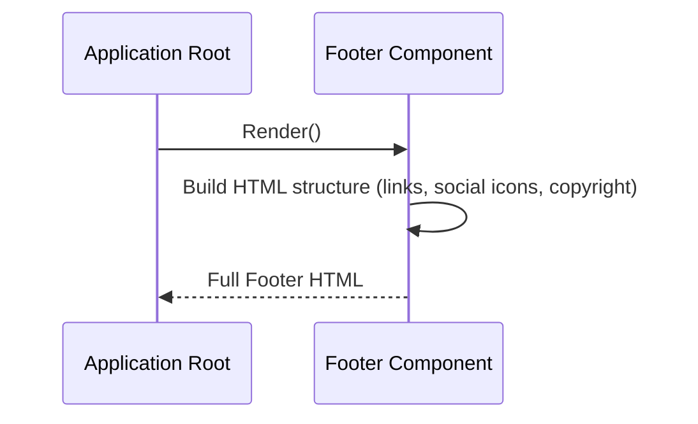

# Chapter 5: Page Footer

Welcome back, web explorer! In our journey through the `marvelUI` project, we've covered the central [Main Content Body](/overview/01_main_content_body_.md), the focused [Featured Comic Section](/overview/02_featured_comic_section_.md), the browsing [Comic Covers Section](/overview/03_comic_covers_section_.md), and the welcoming [Page Header](/overview/04_page_header_.md) at the very top.

Now, let's move to the other end of the page – the very bottom. This is where we find the **Page Footer**. Think of it as the **information desk and resource area you find near the exit of a building**. It's the last section users see before they leave or scroll back up.

## What Problem Does It Solve?

When you're leaving a museum or public building, you often find important things near the exit: maps, brochures with contact info, maybe a place to sign up for a newsletter, or information about policies.

A website's **Page Footer** serves a similar purpose. It solves the problem of providing essential, site-wide information that doesn't need to be front-and-center, but should always be easily accessible. This includes:

*   Links to important legal pages (like Privacy Policy, Terms of Service).
*   Copyright information (who owns the site and when).
*   Contact details or links (like "Careers," "Help").
*   Links to the site's social media pages (Facebook, Twitter, etc.).
*   Sometimes, a sitemap or links to major sections.

For our `marvelUI` project, the Page Footer contains lists of useful links related to Marvel (like careers, Disney+ links), social media icons, and copyright/policy information at the very bottom. It's a wrap-up section with helpful resources.

## The `Footer` Component: Our Exit Information Booth

In our project, the **Page Footer** is represented by a component named `Footer`. Just like the `Header` component handles everything at the top, the `Footer` component contains all the HTML and content needed for the very bottom section of the page.

It's like the blueprint for our website's exit area – it specifies where the lists of links go, where the social media icons appear, and where the copyright text is placed.

## How to Use the `Footer` Component

Using the `Footer` component is very straightforward. You simply include it as the *last* component in your main application file, `src/App.jsx`.

Let's look at how it's included:

```javascript
import React from "react";

import Header from "./marvel/header/header.jsx";
import Body from "./marvel/Body/Body.jsx";
import Comics from "./marvel/footer/Comics.jsx";
import Card from "./marvel/footer/Card.jsx";
// Import the Footer component
import Footer from "./marvel/footer/Footer.jsx";

const App = ()=>{
  return(
    <>
      <Header/>      {/* The Page Header */}
      <Body/>      {/* Our main content area */}
      <Comics/>    {/* Featured Comic spotlight */}
      <Card/>      {/* The Comic Covers gallery */}
      {/* HERE it is! The Page Footer */}
      <Footer/>
    </>
  );
}

export default App;
```
Notice the line `<Footer/>` right at the end of the `return` statement's components. By placing `<Footer/>` here, we tell the application: "Render the content defined by the `Footer` component *last*." This ensures that the footer appears at the very bottom of our webpage, below all the other content.

When the page loads, the `App` component builds the page by assembling the components in this exact order: `Header`, then `Body`, then `Comics`, then `Card`, and finally `Footer`.

## Inside the `Footer` Component: Building the Information Area

Now, let's look inside the `src/marvel/footer/Footer.jsx` file to see how this component is put together to create our page footer.

First, it needs to bring in the necessary tools and potentially some styling:

```javascript
import React from "react"; // Standard tool for building interfaces
import "../footer/Footer.css"; // Stylesheet for the footer's look
// We also need the current year, so we might use JavaScript's Date object
// const date = new Date();
// const year = date.getFullYear();
```
*   `React` is the basic building block.
*   `Footer.css` is a separate file containing styling rules (colors, spacing, layout) for the footer.
*   The standard JavaScript `Date` object is used here to get the current year dynamically for the copyright notice, so it doesn't have to be manually updated each year.

Next, the `Footer` component is defined as a function that returns the HTML structure:

```javascript
export default function Footer() {
  const date = new Date(); // Get the current date
  const year = date.getFullYear(); // Extract the full year

  return (
    <> {/* A fragment to wrap the single main div */}
      {/* Content of the footer goes here */}
    </>
  );
}
```
This is the standard structure. Inside the function, we calculate the `year`, and the `return` statement contains the JSX that will be rendered as the footer.

Inside the `return`, the component sets up the main container for the footer, usually with a dark background as specified in the concept details:

```javascript
      <div className="container-fluid p-5" style={{ background: "#000" }}>
        {/* The footer content will be placed inside this dark container */}
      </div>
```
*   `<div className="container-fluid p-5">` creates a full-width container with padding.
*   `style={{ background: "#000" }}` sets the background color to black.

Inside this main container, the footer is divided into sections using a row and columns, similar to other components:

```javascript
        <div className="row" > {/* A row to hold different sections side-by-side */}
          {/* Sections for link lists and social media go here */}
        </div>
        <div className="row"> {/* A separate row for the copyright information */}
          {/* Copyright and policy links go here */}
        </div>
```
*   The first `row` contains the sections with link lists and social media.
*   The second `row` is specifically for the very bottom line containing copyright and policy links.

Let's look at how the link lists and social media sections are created within the first row:

```javascript
          <div className="col-sm-3 border-bottom"> {/* Column for one list */}
            <ul className="list-group"> {/* An unordered list for links */}
              <li className="list-group">ABOUT MARVEL</li> {/* List item (a link) */}
              <li className="list-group">HELP/FAQS</li>
              {/* ... other list items ... */}
            </ul>
          </div>
          {/* ... repeat col-sm-3 for other link lists ... */}

          <div className="col-sm-3 border-bottom p-2"> {/* Column for social links */}
            <div className="footer-info text-center">
              <p>FOLLOW MARVEL</p> {/* Heading */}
              <div className="social-links mt-3 social-links">
                <a href="" className="fa fa-facebook"></a> {/* A social media icon link */}
                <a href="" className="fa fa-twitter"></a>
                {/* ... other social media icons ... */}
              </div>
            </div>
          </div>
```
*   `<div className="col-sm-3">` creates columns that take up 3 units of width out of 12 on small screens (`sm`) and larger. This allows up to 4 such columns to fit in a row (12 / 3 = 4).
*   `<ul className="list-group">` and `<li className="list-group">` are used to create styled lists of links (though the `href` attributes are empty placeholders `href=""` in this example).
*   The last column in this row (`col-sm-3`) contains a heading ("FOLLOW MARVEL") and a set of `<a>` tags. These links use special classes (`fa fa-facebook`, etc.) likely from a font-icon library like Font Awesome to display social media icons instead of text.

Finally, the second row contains the copyright and policy information:

```javascript
        <div className="row">
          <div className="copyright"> {/* Container for copyright text */}
            Privacy Policy&emsp; Your California Privacy Rights&emsp; {/* Policy links */}
            {/* ... other policy links ... */}
            <div className="credits"> {/* Container for copyright year and text */}
              Marvel Insider Terms ©{year} MARVEL {/* Display the dynamic year */}
            </div>
          </div>
        </div>
```
*   `<div className="copyright">` holds the various text links for policies.
*   `&emsp;` is an HTML entity that creates extra space between the links.
*   `<div className="credits">` contains the final copyright line.
*   `©{year} MARVEL` directly uses the `year` variable calculated earlier to display the current copyright year.

Putting it all together, the `Footer` component builds this entire bottom section, including the dark background, columns with link lists, social media icons, and the copyright text with the dynamic year, and returns it as a single block of HTML ready to be placed at the bottom of the page.

## How it Fits Together (High Level)

When the main application (`App`) is built, it includes the `Footer` component last. Here's a simple view of what happens:



In simple terms:
1.  The main application asks the `Footer` component to show itself.
2.  The `Footer` component calculates the current year and then constructs the specific HTML layout for the entire footer area (the dark container, the rows, the columns with lists, social icons, and copyright).
3.  Finally, the `Footer` component gives this complete block of HTML back to the application to be shown at the very bottom of the screen as the **Page Footer**.

## Conclusion

In this chapter, we learned about the **Page Footer**, the essential bottom section of our website that acts as the information desk and resource area. We saw that this is implemented as the `Footer` component in our `marvelUI` project. We understood how easily it's placed at the end of the main `App.jsx` file to appear at the bottom of the page. We also looked inside the `Footer.jsx` file to see how it uses standard HTML tags like `<div>`, `<ul>`, `<li>`, and `<a>`, along with containers and columns, to structure link lists, display social media icons, and show dynamic copyright information.

It's like creating the final information point before someone exits our website museum, providing helpful links and necessary legal notices.

We've now covered the Header, the main Body with its sections, and the Footer – the main structural components of our page! But how does the entire application actually start and put all these pieces together? In the next chapter, we'll explore the **Application Root**.

[Application Root](/overview/06_application_root_.md)
