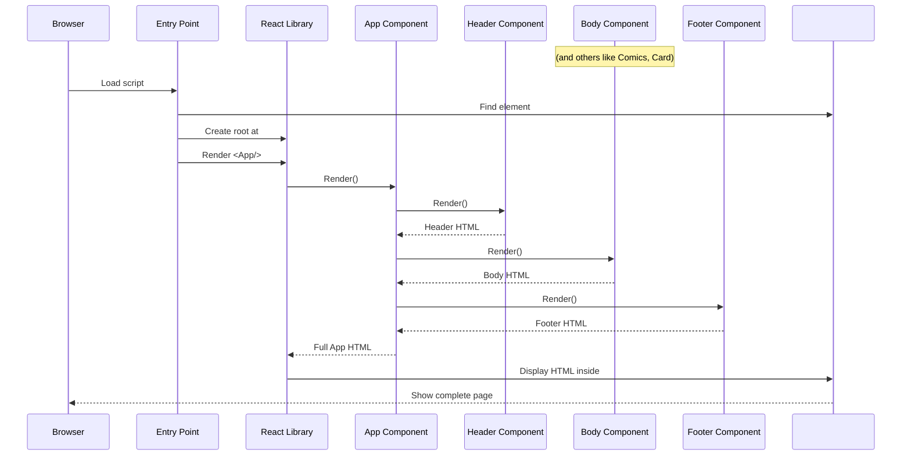

# Chapter 6: Application Root

Welcome back to the `marvelUI` tutorial! We've been exploring the individual building blocks of our website: the [Page Header](/overview/04_page_header_.md) at the top, the [Main Content Body](/overview/01_main_content_body_.md) with its sections for movies and series, the [Featured Comic Section](/overview/02_featured_comic_section_.md), the [Comic Covers Section](/overview/03_comic_covers_section_.md), and the [Page Footer](/overview/05_page_footer_.md) at the bottom.

We have all these great pieces, but how do they all come together to form one complete webpage that a user can see? This is where the **Application Root** comes in.

Think of building a complex structure like a house. You need walls, a roof, windows, and doors. But you also need a foundation and a plan that tells the builders exactly where each piece goes and in what order to put them together to make the final house. The **Application Root** is like that overall plan and the starting point for building the entire website structure.

For our `marvelUI` project, the **Application Root** is responsible for kicking off the entire process, telling the web browser to start building our user interface, and deciding the top-level arrangement of our major sections (like Header, Body, and Footer).

## What Problem Does It Solve?

If you just have separate components like `Header`, `Body`, and `Footer` floating around, the browser doesn't know what to do with them. It doesn't know which ones to display, in what order, or where to put them on the actual page.

The **Application Root** solves this fundamental problem. It acts as the **main entry point** for your application and defines the **highest level structure**. It's the single component or code section that says, "Okay, start building the page now! Put the Header first, then the Body, then the Footer," and so on.

Without an application root, your components would just be isolated pieces of code that never actually show up in the user's browser.

Our goal in this chapter is to understand how the `App` component, combined with the initial setup code, acts as the Application Root, bringing all the pieces together to display the complete `marvelUI` webpage.

## The `App` Component: The Main Blueprint

In our `marvelUI` project, the central piece of the Application Root is typically the `App` component (`src/App.jsx`). This component doesn't display content *itself* in the way the `Body` or `Header` components do. Instead, its main job is to **contain and arrange** the other major components we've built.

It's the master blueprint that lists all the main sections required for the page and specifies their order from top to bottom.

Let's look at the simplified code for our `App` component (`src/App.jsx`) again:

```javascript
import React from "react"; // Needed for components

// Import all the major pieces we've built
import Header from "./marvel/header/header.jsx";
import Body from "./marvel/Body/Body.jsx";
import Footer from "./marvel/footer/Footer.jsx";
import Card from "./marvel/footer/Card.jsx"; // Comic Covers
import Comics from "./marvel/footer/Comics.jsx"; // Featured Comic

const App = ()=>{
  return(
    <> {/* A 'fragment' to wrap multiple main elements */}
      {/* List the components in the order we want them to appear */}
      <Header/>
      <Body/>
      <Comics/>
      <Card/>
      <Footer/>
    </>
  );
}

export default App; // Make App available to be used elsewhere
```

*   The `import` lines at the top bring in all the components we've created in previous chapters. `App` needs to know about them to use them.
*   The `const App = () => { ... }` defines the `App` component.
*   The `return` statement is the most important part here. It lists the other components (`<Header/>`, `<Body/>`, etc.) inside `<>...</>`. This list *is* the top-level structure of our webpage.
*   The order in which these components are listed inside the `return` determines the order they will appear on the page: Header at the top, then Body, then Comics, then Card, and finally Footer at the bottom.
*   `export default App;` makes this `App` component available so that another part of our application can use it (specifically, the very first file that starts everything).

So, the `App` component is simply a parent component whose children are the major sections of our page, arranged in the correct display order.

## The Entry Point: Kicking Everything Off

Having the `App` component ready is great, but how does the browser know to even look at it and start building? This is handled by a special entry point file, typically named `index.jsx` or `main.jsx` in React applications.

This file is the very first piece of JavaScript code that runs when your webpage loads. Its job is to tell React: "Find the place in the HTML document where the application should go, and render the main `App` component there."

Let's look at our project's `index.jsx` file:

```javascript
import React from 'react'; // Needed by React tools
import { StrictMode } from 'react'; // Tool for catching potential problems
import { createRoot } from 'react-dom/client'; // Tool to connect React to browser HTML
import './index.css'; // Styling for the very basic page setup
import App from './App.jsx'; // Import our main App component

// Find the HTML element with the ID 'root' (this is where our app will live)
const container = document.getElementById('root');
const root = createRoot(container); // Create a "root" linked to that HTML element

// Tell React to render the App component inside the 'root' element
root.render(
  <StrictMode> {/* Helps find errors during development */}
    <App/> {/* This is where our App component is told to render! */}
  </StrictMode>,
);
```

*   The import lines bring in the necessary tools from the React library and our own `App` component.
*   `document.getElementById('root')` is standard web JavaScript. It looks for a specific spot in the basic HTML file that loads first (usually `index.html`) – a `<div>` tag with the `id="root"`. This `<div>` is the designated area where our entire React application will be built.
*   `createRoot(container)` prepares React to take control of that specific `<div>` element.
*   `root.render(<App/>)` is the crucial line! This tells React: "Start rendering the content defined by the `<App/>` component, and put it inside the `<div>` we just identified."
*   `<StrictMode>` is a wrapper that activates extra checks to help you find common mistakes while you're developing the application.

This `index.jsx` file is the "starter pistol" for our application. It finds the designated spot in the webpage (`#root`) and injects the entire structure defined by the `App` component into it.

## How it Fits Together: The Orchestration

Putting it all together, the process looks like this:

1.  The web browser loads the basic `index.html` file.
2.  `index.html` contains a link to the JavaScript code, including our compiled `index.jsx`.
3.  The `index.jsx` code runs first.
4.  `index.jsx` finds the `<div id="root"></div>` in the HTML.
5.  `index.jsx` tells React to start rendering the `<App/>` component *inside* that `#root` div.
6.  React starts building the `<App/>` component.
7.  The `App` component, seeing its `return` statement, begins rendering its children: first `<Header/>`, then `<Body/>`, then `<Comics/>`, then `<Card/>`, then `<Footer/>`.
8.  Each of these child components (`Header`, `Body`, etc.) renders its own content (which might include rendering *their* own child components, like the `Body` rendering `Card` components for movies).
9.  React assembles all the resulting HTML structure from all the components in the correct order.
10. React efficiently updates the actual web page in the browser to show the complete structure inside the `<div id="root">`.

Here's a simplified sequence diagram:



This diagram shows the flow from the initial script loading to React building the component tree (`App` rendering its children) and finally displaying the result in the browser's HTML.

The `App` component acts like the conductor, holding the score (the list of components in order), and the `index.jsx` file is the signal to the orchestra to start playing according to that score, assembling the final beautiful music (the webpage).

## Conclusion

In this chapter, we learned about the **Application Root**, which is the starting point and top-level organizer for our entire `marvelUI` application. We saw that this is achieved by combining the `App` component (`src/App.jsx`), which defines the main structure by listing the major sections (Header, Body, Footer, etc.) in order, and the `index.jsx` file, which acts as the entry point, telling React to render the `App` component into a specific spot (`#root`) in the initial HTML page.

Understanding the Application Root is key because it shows how all the individual components we've built are brought together into a single, coherent webpage structure that the user can see and interact with.

Now that we've covered the main structure of the page, let's dive back into some specific components that make up the **Main Content Body**. In the next chapter, we'll take a closer look at the **Movie Card Component**, one of the "display cases" used to show individual movies within the Body.

[Movie Card Component](/overview/07_movie_card_component_.md)
