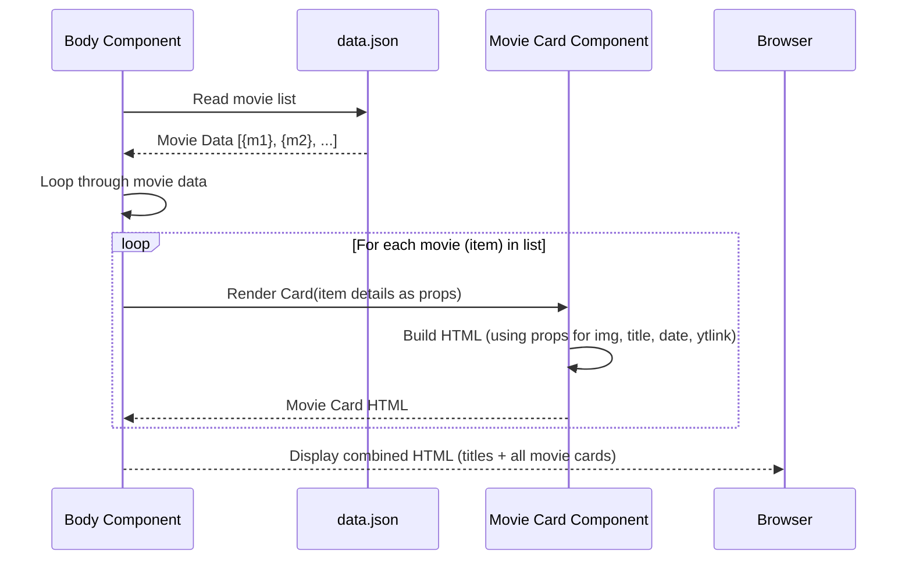

# Chapter 7: Movie Card Component

Welcome back to the `marvelUI` tutorial! In our [previous chapter](/overview/06_application_root_.md), we looked at the **Application Root** – the starting point (`index.jsx`) and main organizer (`App.jsx`) that brings all the big sections of our webpage (like the Header, Body, and Footer) together in the right order.

Now, let's zoom back into the [Main Content Body](/overview/01_main_content_body_.md). Remember how the Body component is like the main exhibition hall, displaying lists of movies and series? In this chapter, we're going to look at the **Movie Card Component**, which is one of the "display cases" used *within* that hall.

Think of a library or a store shelf. You don't just pile up items; you often display them neatly, maybe on a stand or in a specific slot, so you can easily see what each item is. The **Movie Card Component** does exactly this for a single movie.

It's a reusable piece designed to show the key details of *one* movie – its picture, title, release date, and a button to watch the trailer – in a standardized way. This makes the list of movies in the [Main Content Body](/overview/01_main_content_body_.md) look clean, organized, and easy to browse.

## What Problem Does It Solve?

Imagine listing movies in the [Main Content Body](/overview/01_main_content_body_.md) like this:

Movie 1: Avengers Endgame, Image: [link], Date: 2019, Trailer: [link]
Movie 2: Iron Man, Image: [link], Date: 2008, Trailer: [link]
...and so on for dozens of movies.

This would be very hard to read and look messy.

The **Movie Card Component** solves the problem of displaying information about many similar items (movies) in a consistent, visually appealing, and space-efficient way. Instead of just text, it creates a structured "card" for each movie, making the list easy to scan and interact with. It provides a dedicated container for each movie's details, keeping everything neat.

Our goal in this chapter is to understand how the `Movie Card Component` is built and how the [Main Content Body](/overview/01_main_content_body_.md) uses it to display the list of movies.

## The `Card` Component: Our Movie Display Stand

In our project, the **Movie Card Component** is handled by a component named `Card`. This component is located in the file `src/marvel/Body/Movies.jsx`.

*Note: We encountered another component also named `Card` in [Chapter 3](/overview/03_comic_covers_section_.md) which is used for displaying multiple comic covers. While they share the same general name ('Card' often implies a contained block of information), they are completely separate components defined in different files (`src/marvel/footer/Card.jsx` for comic covers vs. `src/marvel/Body/Movies.jsx` for movie cards) and designed for different purposes (displaying *one* movie vs. displaying *multiple* comic covers). It's important to remember that in this chapter, when we say `Card`, we specifically mean the one from `src/marvel/Body/Movies.jsx` used for movies.*

This `Card` component knows how to take information about a single movie (like its image URL, title, etc.) and turn it into the visual card display you see on the webpage.

## How to Use the `Movie Card Component` (from the `Body` Component)

We briefly saw in [Chapter 1](/overview/01_main_content_body_.md) how the [Main Content Body](/overview/01_main_content_body_.md) component (`src/marvel/Body/Body.jsx`) displays the list of movies. Let's look at that snippet again, focusing on how it uses our `Movie Card Component`.

```javascript
// Inside src/marvel/Body/Body.jsx
// ... other imports

import Card from "./Movies"; // Import our Movie Card Component!
// ... import data from '../data/data.json'

const Body = () => {
  return (
    // ... container for the movie section ...
    <div className="row">
      {
      data.map((item) =>{ // Loop through each movie item in the data
        return (
          <div className="col"> {/* Create a column for each movie card */}
            <Card               {/* USE the Movie Card Component! */}
              key={item.id}     {/* Unique ID for React */}
              img={item.img}    {/* Pass the image URL */}
              title={item.title}  {/* Pass the movie title */}
              date={item.date}    {/* Pass the release date */}
              id={item.id}        {/* Pass the ID (used for the modal) */}
              ytlink={item.ytlink} {/* Pass the YouTube link for trailer */}
            />
          </div>
        );
      })
    }
    </div>
    // ... rest of Body component
  );
};
// ... export default Body;
```

In this code:
1.  `import Card from "./Movies";` brings the `Movie Card Component` into `Body.jsx` so `Body` can use it.
2.  `data.map((item) => { ... })` is the core of the movie list display. It goes through *each* item (each movie) in the `data` list.
3.  For every `item`, it renders a `<Card ... />` component. This is how `Body` *uses* the `Movie Card Component`.
4.  Notice how information like `item.img`, `item.title`, etc., is put inside the `<Card ... />` tag using `attribute={value}` syntax (e.g., `img={item.img}`). These are called **props** (short for "properties"). `Body` is *passing* the specific details of the current movie (`item`) as props to the `Card` component.

Think of it like placing an order: the `Body` component says "Give me a `Card`!" and then provides the ingredients (props) for *this specific movie* so the `Card` knows what picture, title, and date to display.

## Inside the `Movie Card Component`: Building the Display Stand

Now let's look inside the `src/marvel/Body/Movies.jsx` file to see how the `Card` component is built and how it uses the props it receives to create the visual display for one movie.

First, the component needs to import React and some extra tools related to the trailer modal:

```javascript
// Inside src/marvel/Body/Movies.jsx
import React, { useRef, useEffect } from "react"; // React + tools for effects/references

// The component is defined as a function that accepts 'prop' as an argument
const Card = (prop) => {
  // These lines are for managing the video modal, we'll explain them simply later
  const iframeRef = useRef(null);
  useEffect(() => {
    // ... modal logic ...
  }, [prop.id, prop.ytlink]);

  // This function returns the HTML structure for ONE movie card
  return (
    <>
      {/* The main container for the card */}
      <div className="card container text-dark p-2 shadow mb-5 rounded" style={{ width: "18rem" }}>
        {/* Content goes here */}
      </div>

      {/* This is the hidden pop-up (modal) for the trailer */}
      <div className="modal fade" id={prop.id} tabIndex="-1" aria-labelledby={"example"+prop.id} aria-hidden="true">
        {/* ... modal structure with iframe ... */}
      </div>
    </>
  );
};

export default Card; // Make the component available for others to use
```

*   `import React, { useRef, useEffect } from "react";` brings in the core React functionality and two extra features (`useRef` and `useEffect`) used for handling the pop-up video player.
*   `const Card = (prop) => { ... }` defines the `Card` component as a function. The `(prop)` part is crucial – this function automatically receives an object (we named it `prop`) that contains all the props (`img`, `title`, `date`, etc.) that the `Body` component passed to it.
*   The `useRef` and `useEffect` lines are a bit advanced, but they are there to make sure that when the movie trailer pop-up window closes, the video stops playing. `prop.id` and `prop.ytlink` are used by this logic. You don't need to fully understand *how* they work right now, just that they are part of the component's behavior.
*   The `return` statement contains the JSX (HTML-like code) that will be rendered for this single movie card. It includes the visual card structure and the hidden pop-up (modal) that appears when you click the "Watch Trailer" button.

Let's look closer at the main card structure within the `return` statement:

```javascript
      <div
        className="card container text-dark p-2 shadow mb-5  rounded "
        style={{ width: "18rem" }}
      >
        <div className="">
           {/* Image */}
          <div className="card-body mb-2 ">
            <h5 className="card-title">{prop.title}</h5> {/* Title */}
            <strong className="card-text">Release Date</strong>
            <p className="card-text">{prop.date}</p> {/* Date */}
            {/* <p className="card-text">{prop.about}</p> - (About text not used in final layout) */}
            <button                                {/* Trailer Button */}
              type="button"
              className="btn btn-primary shadow  w-100 "
              data-bs-toggle="modal"
              data-bs-target={'#'+prop.id} // Connects button to the modal with this ID
            >
              Watch Trailer Now
            </button>
          </div>
        </div>
      </div>
```

*   The main `div` with classes like `card`, `container`, etc., sets up the basic box shape and styling for the card. `style={{ width: "18rem" }}` gives it a fixed width.
*   ``: This is where the movie image is displayed. Crucially, `src={prop.img}` uses the `img` prop that was passed to the component. The `prop` object has a property called `img`, and its value is the image URL for this specific movie. The `Card` component uses this value to load the correct picture.
*   `<h5 className="card-title">{prop.title}</h5>`: Displays the movie title. It uses the `title` prop passed by `Body`.
*   `<p className="card-text">{prop.date}</p>`: Displays the movie release date, using the `date` prop.
*   `<button ...>`: This is the "Watch Trailer Now" button. The `data-bs-toggle="modal"` and `data-bs-target={'#'+prop.id}` are special attributes (likely from Bootstrap) that tell the button to open a modal (pop-up) window, specifically the one whose ID matches the `id` prop passed to the card.
*   Notice the use of curly braces `{}` around `prop.img`, `prop.title`, `prop.date`, and `'#'+prop.id`. In JSX, curly braces allow you to insert JavaScript expressions (like variables or calculations) directly into the HTML structure. This is how the `Card` component dynamically uses the data it received through its `prop` object.

The second main part of the `return` statement is the code for the trailer modal (the pop-up window). It's hidden by default (`className="modal fade"`):

```javascript
          <div
            className="modal fade" // Makes it a hidden modal pop-up
            id={prop.id}           // Gives the modal a unique ID based on the movie's ID prop
            tabIndex="-1"
            aria-labelledby={"example"+prop.id}
            aria-hidden="true"
          >
            {/* ... modal dialog container ... */}
              <div className="modal-content">
                {/* ... modal header with title and close button ... */}
                <div className="modal-body">
                  <iframe  // The actual trailer video player
                    ref={iframeRef} // Used by the useEffect hook
                    width="100%"
                    height="98%"
                    src={prop.ytlink} // Uses the ytlink prop for the video source
                    title="YouTube video player"
                    frameBorder="0"
                    allow="accelerometer; autoplay; clipboard-write; encrypted-media; gyroscope; picture-in-picture"
                    allowFullScreen
                  ></iframe>
                </div>
              </div>
            {/* ... end modal dialog container ... */}
          </div>
```
*   This `div` defines the structure of the pop-up window that appears when the button is clicked.
*   `id={prop.id}` gives this specific modal a unique ID based on the movie's ID, so the button knows which modal to open.
*   The `<iframe>` tag is used to embed the YouTube video player directly into the modal body.
*   `src={prop.ytlink}` is where the magic happens – it uses the `ytlink` prop (the YouTube trailer URL) passed by the `Body` component to load the correct trailer video for this specific movie.

So, the `Movie Card Component` receives the movie's data via `prop`, then constructs a piece of HTML that includes the image, title, date (using the data from `prop`), and a button that triggers a pop-up window (also using the data from `prop`) containing the movie's trailer.

## How it Fits Together (High Level)

Here's how the `Movie Card Component` works with the `Body` component and the data:



In simple terms:
1.  The `Body` component gets the list of movies from `data.json`.
2.  It loops through this list, one movie at a time.
3.  For each movie, it asks the `Movie Card Component` to render itself, passing the specific details of *that* movie (image, title, date, trailer link) as props.
4.  The `Movie Card Component` takes these props and creates the specific HTML structure for one movie card, including the image, title, date, and the trailer modal.
5.  The `Movie Card Component` gives the generated HTML for that one card back to the `Body` component.
6.  The `Body` component collects the HTML from all the individual movie cards and puts them together in the correct layout within its movie section container.
7.  Finally, the browser displays this complete structure as the list of movie cards.

Each `Movie Card Component` is independent; it just needs the specific movie's data (props) to know what to show. The `Body` component is responsible for providing that data for *every* movie in the list.

## Conclusion

In this chapter, we took a deep dive into the **Movie Card Component** (`src/marvel/Body/Movies.jsx`), one of the fundamental building blocks used within the [Main Content Body](/overview/01_main_content_body_.md). We learned that it's a reusable piece designed to display the information for a *single* movie in a structured "card" format, including the image, title, release date, and a button to watch the trailer via a pop-up modal. We saw how the `Body` component loops through the movie data and uses the `Card` component for each movie, passing the specific movie's details as **props**. We also peeked inside the `Card` component's code to see how it uses those props to dynamically display the correct image, title, date, and trailer video within its HTML structure.

It's like creating a standard display case blueprint and then using that blueprint to build a case for every item (movie) you have, filling each case with the specific details of the item it holds.

Now that we understand how individual movies are displayed, let's look at how individual TV series are displayed, which uses a different component. In the next chapter, we'll explore the **Series Display Component**.

[Series Display Component](/overview/08_series_display_component_.md)

