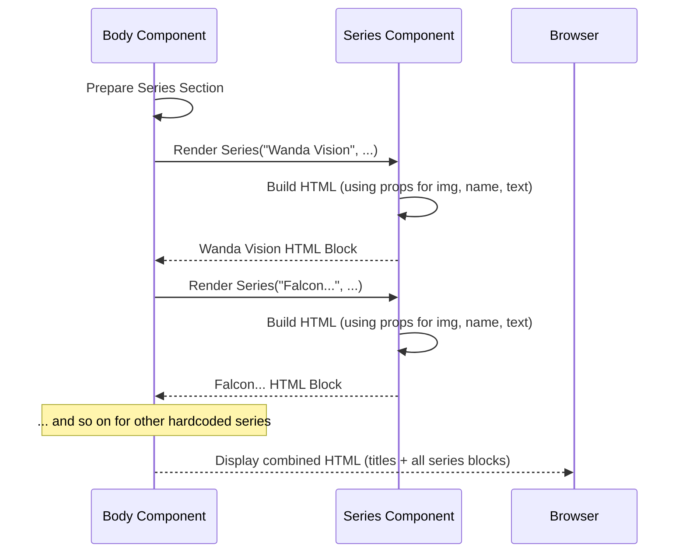

# Chapter 8: Series Display Component

Welcome back to the `marvelUI` tutorial! In our [previous chapter](/overview/07_movie_card_component_.md), we learned about the **Movie Card Component** – a reusable piece that helps us display information about a single movie in a neat, compact card format within the [Main Content Body](/overview/01_main_content_body_.md).

Now, let's look at the other type of content displayed in the [Main Content Body](/overview/01_main_content_body_.md): the Marvel TV series. While movies are shown in a browseable card list, TV series are displayed differently, with more detail upfront. This is handled by the **Series Display Component**.

Think of our website like a museum again. The movie cards are like the items displayed on shelves – you see many at once, mostly just the cover art and title. The series display component, however, is more like a **detailed plaque next to an exhibit**. It focuses on one item (a TV series) and provides its image, name, and a more extensive text description right there, making each series stand out individually with more context.

## What Problem Does It Solve?

We could technically use the same "card" style for series as we do for movies, but the design of the `marvelUI` project has a different goal for displaying series. It aims to give each series a more prominent spot with a detailed description immediately visible, rather than just a brief title and image in a grid.

The **Series Display Component** solves the problem of presenting detailed information for individual TV series in a distinct, block-like format within the main content area. It ensures that each series gets its own dedicated space with both visual appeal (image) and significant textual information (description), separating them visually and informationally from the movie listings.

Our goal in this chapter is to understand how the `Series` component is built and how the [Main Content Body](/overview/01_main_content_body_.md) uses it to display the specific list of TV series.

## The `Series` Component: Our Detailed Exhibit Plaque

In our project, the **Series Display Component** is handled by a component named `Series`. This component is located in the file `src/marvel/Body/series.jsx`.

This `Series` component is specifically designed to take information about a single TV series (like its name, image URL, and description text) and format it into the visual layout you see on the webpage – an image on one side and the title and description on the other.

## How to Use the `Series Display Component` (from the `Body` Component)

We briefly saw in [Chapter 1](/overview/01_main_content_body_.md) how the [Main Content Body](/overview/01_main_content_body_.md) component (`src/marvel/Body/Body.jsx`) displays the list of series. Let's look at that snippet again, focusing on how it uses our `Series` component.

```javascript
// Inside src/marvel/Body/Body.jsx
// ... other imports (including import Series from "./series";)

const Body = () => {
  return (
    // ... movie section ...

    <div className="container-fluid bg-danger  text-light p-4 text-center">
      <h1>Watch All Series of Marvel on Disney+ Hotstar</h1>
    </div>

    {/* USE the Series Display Component for Wanda Vision! */}
    <Series
      name="Wanda Vision" // Pass the series name
      img="https://mlpnk72yciwc.i.optimole.com/cqhiHLc.WqA8~2eefa/w:auto/h:auto/q:75/https://bleedingcool.com/wp-content/uploads/2021/02/EtJXFJyVEAER0n3.jpeg" // Pass the image URL
      text="WandaVision premiered..." // Pass the description text (long text shown here)
    />

    {/* USE the Series Display Component for Falcon and Winter Soldier! */}
    <Series
      name="Falcon and the Winter Soldier"
      img="https://m.media-amazon.com/images/M/MV5BODNiODVmYjItM2MyMC00ZWQyLTgyMGYtNzJjMmVmZTY2OTJjXkEyXkFqcGdeQXVyNzk3NDUzNTc@._V1_.jpg"
      text="The Falcon and the Winter Soldier premiered..."
    />

    {/* ... and so on for other Series components, like Loki and WHAT IF ... */}

    // ... rest of Body component
  );
};
// ... export default Body;
```

In this code:
1.  `import Series from "./series";` brings the `Series Display Component` into `Body.jsx` so `Body` can use it.
2.  Unlike the movies, which are loaded from a data file and displayed using a `map` loop, the series are added **one by one** directly within the `Body` component's JSX.
3.  For each series (`Wanda Vision`, `Falcon and the Winter Soldier`, etc.), a `<Series ... />` component is rendered. This is how `Body` *uses* the `Series` component.
4.  Information like the series name (`name`), image URL (`img`), and description text (`text`) is passed directly as **props** to the `Series` component using `attribute="value"` syntax (e.g., `name="Wanda Vision"`). The text descriptions are quite long in the actual code, but they are passed as a single `text` prop.

So, the `Body` component directly lists each series it wants to display, explicitly telling each `Series` component exactly what content (name, image, text) it should show by passing that information as props.

## Inside the `Series Display Component`: Building the Exhibit Plaque

Now let's look inside the `src/marvel/Body/series.jsx` file to see how the `Series` component is built and how it uses the props it receives to create the detailed display for one series.

First, the component needs to import React and the `Tilt` tool (which we saw in the comic covers chapter):

```javascript
// Inside src/marvel/Body/series.jsx
import React from "react"; // Standard React tool
import Tilt from "react-parallax-tilt"; // Tool for the tilt visual effect

// The component is defined as a function that accepts 'prop' as an argument
const Series = (prop) => {
  // This function returns the HTML structure for ONE series display block
  return (
    <> {/* A fragment to wrap multiple elements */}
      {/* The main container for the series display */}
      <div className="container text-light">
        {/* Content goes here */}
      </div>
      <hr /> {/* A horizontal line for separation */}
    </>
  );
};

export default Series; // Make the component available for others to use
```

*   `import React from "react";` brings in the core React functionality.
*   `import Tilt from "react-parallax-tilt";` brings in the optional `Tilt` effect.
*   `const Series = (prop) => { ... }` defines the `Series` component as a function. Like the Movie Card component, it receives an object (we named it `prop`) that contains all the props (`name`, `img`, `text`) that the `Body` component passed to it.
*   The `return` statement contains the JSX (HTML-like code) that will be rendered for this single series display block. It includes the main content container and a horizontal rule (`<hr />`) for visual separation from the next series.

Let's look closer at the structure within the main `div className="container text-light"`:

```javascript
      <div className="container text-light">
        <div className="row"> {/* A row to put content side-by-side */}
          <div className="col-sm-6"> {/* Column for the image on one side */}
            <div className=""> {/* Extra container for padding/margins */}
              <div className="p-5"> {/* Padding around the image */}
                <Tilt> {/* Apply the tilt effect */}
                  {/* The Series Image */}
                  
                </Tilt>
              </div>
            </div>
          </div>
          <div className="col-sm-6"> {/* Column for the text on the other side */}
            <div> {/* Extra container */}
              <div className="p-5"> {/* Padding around the text */}
                {/* The Series Name */}
                <h1 className=" text-center ">{prop.name}</h1>
                {/* A sub-heading */}
                <h4 className=" text-center">
                  Now stream all Episode of {prop.name} available on Disney+
                  hotstar
                </h4>
                <hr /> {/* A horizontal line */}
                {/* The Series Description */}
                <p className="">{prop.text}</p>
              </div>
            </div>
          </div>
        </div>
      </div>
```

*   `<div className="row">` sets up a horizontal row within the container.
*   `<div className="col-sm-6">` creates two columns. On small screens (`sm`) and larger, each column takes up 6 units of width out of 12 (half the row). On smaller screens, these columns will stack vertically (image above text), thanks to the `col-sm-6` class. This creates the side-by-side layout on larger screens.
*   Inside the first column (for the image):
    *   `<Tilt>` wraps the image to add the tilt effect.
    *   ``: This is where the series image is displayed. `src={prop.img}` uses the `img` prop passed by the `Body` component. The `Series` component uses this value to load the correct picture. `alt={prop.name}` uses the `name` prop for accessibility.
*   Inside the second column (for the text):
    *   `<h1 className=" text-center ">{prop.name}</h1>`: Displays the series name using the `name` prop.
    *   `<h4 className=" text-center"> ... {prop.name} ... </h4>`: Displays a subtitle that also uses the `name` prop.
    *   `<p className="">{prop.text}</p>`: Displays the longer series description using the `text` prop.
*   The curly braces `{}` around `prop.img`, `prop.name`, and `prop.text` are JSX syntax to embed the values from the `prop` object directly into the HTML structure.

So, the `Series Display Component` receives the series' data via `prop`, then constructs a piece of HTML that arranges the image on one side and the name, subtitle, and description on the other, using the data from the `prop` object. It returns this structured HTML block for one series.

## How it Fits Together (High Level)

Here's how the `Series Display Component` works with the `Body` component:



In simple terms:
1.  The `Body` component includes a section for series.
2.  Within this section, the `Body` component explicitly lists each series it wants to display.
3.  For each series, it asks the `Series Display Component` to render itself, passing the specific details of *that* series (name, image, text description) as props.
4.  The `Series Display Component` takes these props and creates the specific HTML structure for one series display block, arranging the image and text side-by-side.
5.  The `Series Display Component` gives the generated HTML for that one series block back to the `Body` component.
6.  The `Body` component places each returned series HTML block one after another in its series section.
7.  Finally, the browser displays this complete structure.

Each `Series Display Component` instance is independent and knows how to display *one* series based on the specific data it receives via its props. The `Body` component is responsible for creating an instance of the `Series` component for each series it intends to show and providing the necessary data.

## Conclusion

In this chapter, we explored the **Series Display Component** (`src/marvel/Body/series.jsx`), another key building block used within the [Main Content Body](/overview/01_main_content_body_.md). We learned that it provides a more detailed, plaque-like display for individual TV series, distinct from the more compact movie cards. We saw how the `Body` component directly lists instances of the `Series` component, passing the series' name, image URL, and detailed description as **props**. We also looked inside the `Series` component's code to see how it uses these props to dynamically build an HTML structure that lays out the image and text content side-by-side, creating the detailed display for each series.

It's like having a different blueprint for a detailed exhibit plaque, and then using that blueprint to create a custom plaque for each specific series, filling in its unique information.